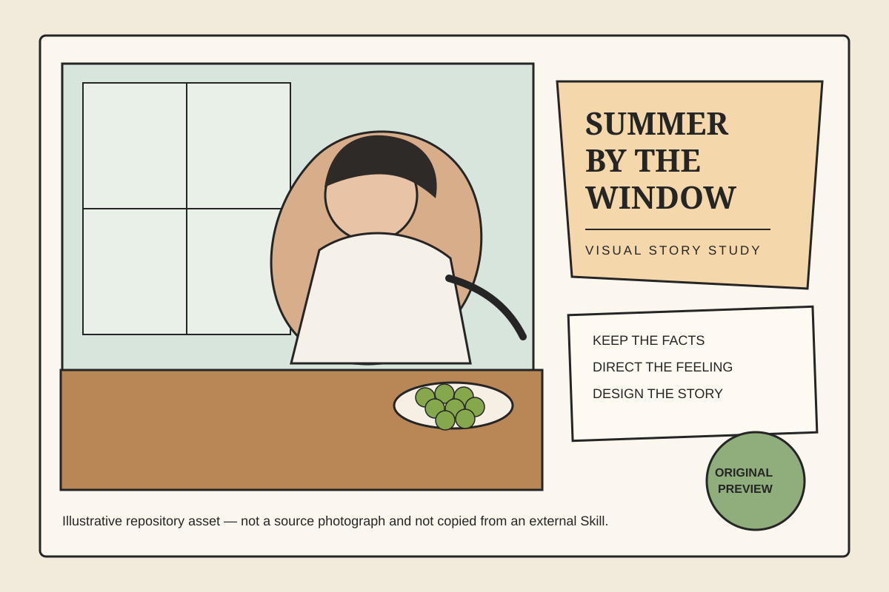

# Skills Index

This directory contains personal Codex skills.

## Engineering

- `ai-coding-discipline`: execution-gate skill for disciplined implementation, reuse, boundaries, incremental verification, and maintainability.
- `ai-coding-paradigm`: engineering analysis and AI-assisted development prompting.
- `market-commercialization-strategist`: market-manager lens for user attraction, retention, product-market fit, monetization, landing pages, README positioning, and commercial maturity.

## Documentation

- `client-technical-reporting`: Chinese client-facing technical delivery reports for migration, API replacement, changed locations, troubleshooting, joint debugging confirmations, and summaries.
- `internal-project-doc-standardizer`: internal README/docs/agent.md standardization.
- `project-structure-review`: repository structure and submission readiness review.

## Prompting

- `project-prompt-polisher`: rewrite rough Chinese task requests into executable prompts across product, UI/frontend, backend/API, docs, tests, refactors, automation, and handoff work.

## Content

- `wechat-article-image-planner`: plan cover art, inline illustrations, summary posters, visual prompts, placement, and optional image generation for finalized WeChat Official Account articles.

## Visual AI

- `visual-story-image-director`: transform ordinary images into story-driven visual assets through AI art direction, scene understanding, composition planning, and purpose-driven generation.

### Example Preview

See the full case: [`window-side-summer-afternoon.md`](visual-story-image-director/examples/window-side-summer-afternoon.md)
