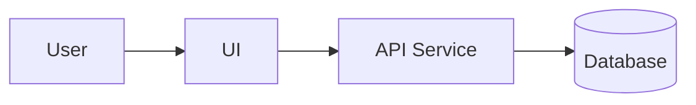

# Architecture

## 1. Tech Stack

| Layer | Technology | Version | Notes |
|---|---|---|---|
| Frontend | TBD | TBD | TBD |
| Backend | TBD | TBD | TBD |
| Database | TBD | TBD | TBD |
| Build tool | TBD | TBD | TBD |

## 2. Architecture Overview



## 3. Module Responsibilities

| Module | Responsibility | Depends On |
|---|---|---|
| TBD | TBD | TBD |

## 4. Directory Structure

```text
.
├── README.md
├── agent.md
├── docs/
├── src/
└── tests/
```

## 5. Data Flow

1. TBD
2. TBD
3. TBD

## 6. Important Decisions

| Decision | Reason | Tradeoff | Date |
|---|---|---|---|
| TBD | TBD | TBD | TBD |

## 7. Risks

| Risk | Impact | Mitigation |
|---|---|---|
| TBD | TBD | TBD |
