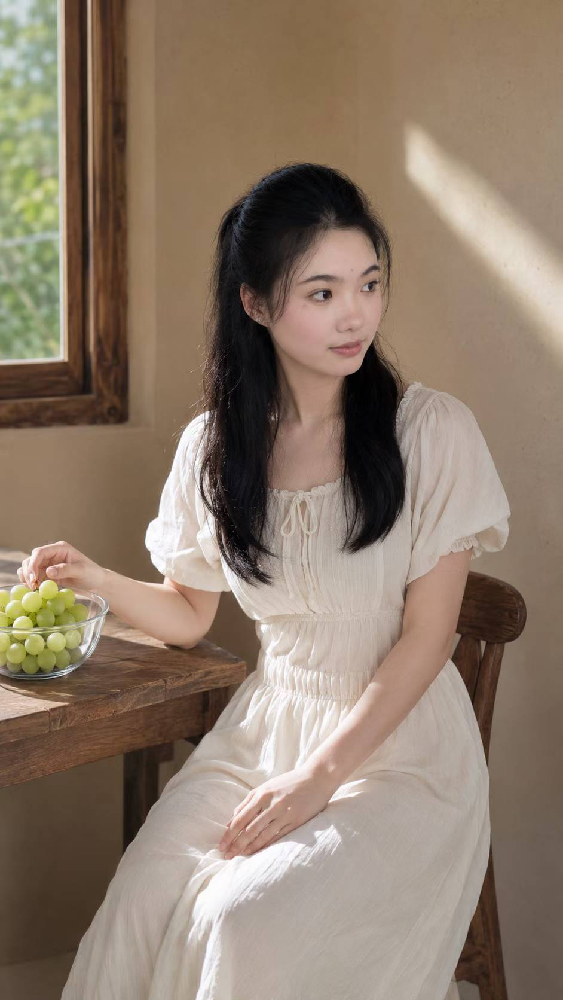

# Case: Window-side Summer Afternoon

> This case uses the repository image asset below as the visual reference. The analysis, workflow, and write-up are original to `self_skills`; external Skills may inspire principles, but their prose, prompts, examples, and file structures are not copied.

## Input Scene

A single-person indoor portrait beside a window. Soft natural light falls across the subject. A wooden table and a small bowl of green grapes are visible. The overall feeling is quiet, fresh, and summery.

## Communication Goal

Turn the ordinary portrait into an intimate independent-magazine / zine page that feels designed and memorable without losing the original person, window light, table, grapes, or calm summer atmosphere.

## Scene Diagnosis

- Primary subject: the person at the window.
- Environmental anchor: soft daylight entering from the window.
- Object anchor: green grapes on the wooden table.
- Emotional residue: quiet, gentle, unhurried summer afternoon.

## Must Preserve

- the person as the visual focus
- the window-side relationship and natural-light direction
- the wooden table and grapes as memory cues
- the restrained summer mood

## Primary Art Direction

Quiet Summer Editorial Zine.

Keep the portrait recognizable. Add restrained paper texture, editorial framing, and subtle collage language. The goal is a designed visual story, not a simple filter effect.

## Generation / Edit Brief

- **Subject:** keep the original person as the dominant focal point.
- **Composition:** preserve the window-side spatial relationship, retain the table and grapes, and create controlled negative space for editorial rhythm.
- **Visual language:** independent editorial zine with subtle paper texture, restrained collage layers, clean framing, and tactile print character.
- **Lighting and color:** preserve the soft natural window light; keep the palette fresh and summery rather than pushing it into heavy vintage tones.
- **Mood:** intimate, quiet, gentle, unhurried.
- **Preservation constraints:** do not alter identity, pose, key scene geometry, table, grapes, or the direction of the window light.
- **Typography treatment:** if graphic type is used, keep it minimal and decorative; do not invent fake readable article copy.
- **Usage:** social/editorial showcase.
- **Aspect ratio:** 4:5 by default.

## Avoid

- changing identity
- inventing people or events
- excessive decoration
- fake readable magazine copy
- replacing the original scene with a generic fantasy setting
- overpowering the portrait with collage elements

## Format

Default: 4:5 for social/editorial showcase.

## QA

- Does the image still feel like the same moment?
- Is the original person still clearly the focal point?
- Are the window light, wooden table, and grapes still recognizable anchors?
- Does the design improve the story rather than merely add decoration?
- Are details clean and usable at the target size?
